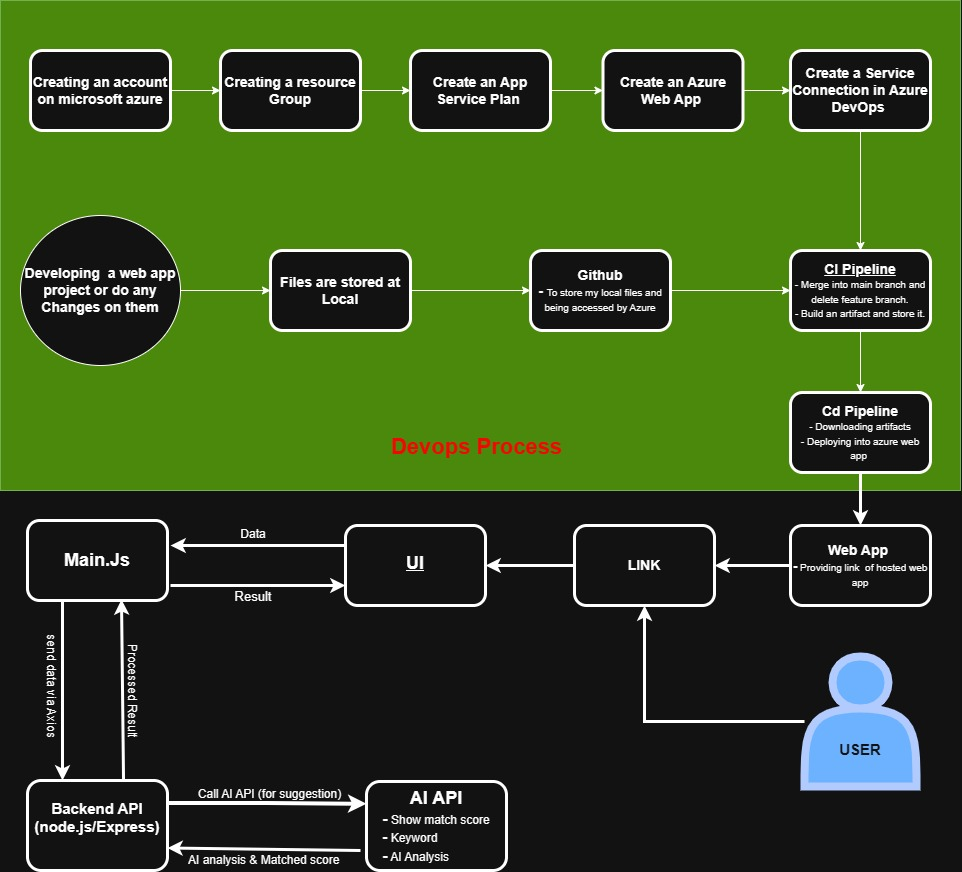

# ATS Resume Tracker

[](LICENSE)
[](https://ats-resume-tracker-cdgcfhake2caeeet.canadacentral-01.azurewebsites.net)

## Table of Contents
- [Overview](#overview)
- [Demo](#demo)
- [Features](#features)
- [Requirements](#requirements)
- [Installation](#installation)
- [Usage](#usage)
- [DevOps & Deployment on Azure](#devops--deployment-on-azure)
- [Architecture & Workflow](#architecture--workflow)
- [Contribution](#contribution)
- [License](#license)
- [Contact](#contact)

## Overview

ATS Resume Tracker is a web application that helps job seekers optimize their resumes for Applicant Tracking Systems (ATS) by analyzing them against job descriptions. It extracts keywords, calculates a match score, identifies missing skills, and provides AI-powered suggestions using Hugging Face models. The project is built with Node.js, Express, and a modern frontend, and is deployed on Azure for public access.

---

## Demo

[](https://www.youtube.com/watch?v=5T5PlRVLw_4)

**Live Demo:** [Open ATS Resume Tracker](https://ats-resume-tracker-cdgcfhake2caeeet.canadacentral-01.azurewebsites.net)

---

## Features

- Resume vs. Job Description Analysis: Upload your resume and paste a job description to get a match score.
- Keyword Extraction: Extracts technical skills, soft skills, and tools from both resume and job description.
- Missing Keywords: Identifies keywords present in the job description but missing from your resume.
- AI-Powered Suggestions: Uses Hugging Face AI to provide tailored suggestions for improvement.
- User-Friendly Interface: Clean, responsive UI for easy use.
- PDF Resume Support: Accepts text-based PDF resumes up to 5MB.
- Help & Instructions: Built-in help section for new users.

---

## Requirements

- Node.js (v18 or above recommended)
- npm (v9 or above)
- Hugging Face API key (for AI analysis)
- Azure account (for deployment)
- [Optional] Azure CLI for deployment automation

---

## Quick Start

1. **Live Demo:** [Open ATS Resume Tracker](https://ats-resume-tracker-cdgcfhake2caeeet.canadacentral-01.azurewebsites.net)
2. **Try Locally:**
    - Clone the repo and follow the [Installation](#installation) steps below.

---

## Technologies Used

- Node.js, Express (Backend)
- HTML, CSS, JavaScript (Frontend)
- Hugging Face API (AI Analysis)
- Azure (Deployment)

---

## Installation

1. **Clone the repository**
    ```bash
    git clone https://github.com/YOUR_GITHUB_ID/ats-resume-tracker.git
    cd ats-resume-tracker
    ```

2. **Install backend dependencies**
    ```bash
    cd backend
    npm install
    ```

3. **Install frontend dependencies (if any)**
    ```bash
    cd ../frontend
    # If you use npm packages for frontend, otherwise skip
    npm install
    ```

4. **Set up environment variables**
    - Create a `.env` file in the `backend` directory:
      ```
      HF_API_KEY=your_huggingface_api_key
      ```

5. **Run locally**
    ```bash
    # In backend directory
    node server.js
    # Or, if you use nodemon
    npx nodemon server.js
    ```
    - Open `frontend/index.html` with Live Server or any static server.

---

## Usage

1. Open the app in your browser (locally or via the live Azure link).
2. Paste the job description and upload your resume (PDF).
3. Click **Analyze Resume**.
4. View your match score, extracted keywords, missing keywords, and AI-powered suggestions.

---

## FAQ

**Q: Why is AI analysis unavailable?**  
A: The Hugging Face API may have reached its free monthly quota. Try again later or use your own API key.

**Q: What file types are supported?**  
A: Only text-based PDF resumes up to 5MB are supported.

**Q: How do I deploy to my own Azure account?**  
A: Follow the steps in the [DevOps & Deployment on Azure](#devops--deployment-on-azure) section.

---

## Contribution

Contributions are welcome! To contribute:
- Fork the repository
- Create a new branch (`git checkout -b feature/your-feature`)
- Commit your changes (`git commit -am 'Add new feature'`)
- Push to the branch (`git push origin feature/your-feature`)
- Open a pull request

Please open an issue for suggestions or bug reports.

---

## License

This project is licensed under the MIT License.

---


## Workflow

### DevOps and Application Workflow



- **DevOps Process:**
  - Create Azure account, resource group, app service plan, web app, and service connection in Azure DevOps.
  - Develop the web app locally, push to GitHub.
  - CI Pipeline: Merge, build, artifact creation.
  - CD Pipeline: Download artifact, deploy to Azure App Service.
  - Web app is live and accessible via public link.

- **App Logic:**
  - User interacts with the web app UI (main.js, index.html).
  - Data is sent to backend API (Node.js/Express).
  - Backend parses PDF, extracts keywords, calls Hugging Face AI API for suggestions.
  - Results (match score, keywords, AI analysis) are returned to the frontend and displayed to the user.

---


## Test Case

A sample resume PDF is provided for testing purposes:

- [Download test_cases.pdf](./test_cases.pdf)

To use as a test case:
1. Download the above PDF.
2. Upload it in the application to verify resume parsing and analysis features.

---

**Note:**  
AI analysis may be unavailable if the Hugging Face API monthly quota is exceeded on the free plan.


## Contact

- **GitHub:** [shivam-dce](https://github.com/shivam-dce)
- **Email:** shivamkumarkaimur@gmail.com
- **LinkedIn:** [Shivam Kumar](https://www.linkedin.com/in/shivamkumarkaimur/)

---