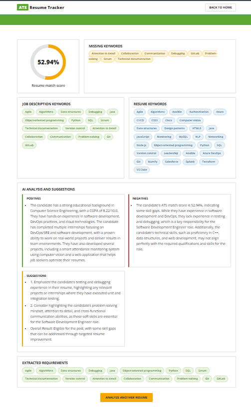
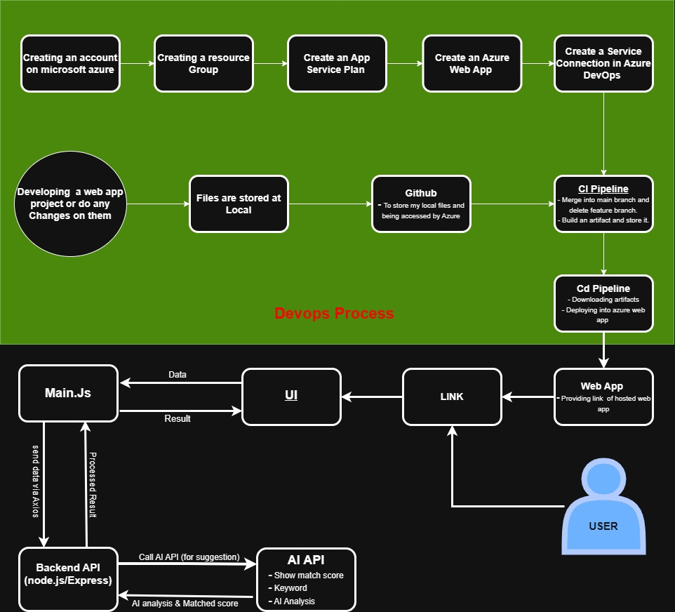

# ATS Resume Tracker

Check how well your resume matches a job description before you apply. Upload a PDF resume, paste a job description, and get a match score, missing keywords and AI-written feedback in seconds.

[](LICENSE)
[](https://resume-ats-tracker-0zkn.onrender.com)


**Live demo:** https://resume-ats-tracker-0zkn.onrender.com

> The app runs on a free hosting tier. After a period of inactivity it goes to sleep, so the first request can take 30 to 60 seconds.

## Table of contents

- [Overview](#overview)
- [Features](#features)
- [Tech stack](#tech-stack)
- [Project structure](#project-structure)
- [Getting started](#getting-started)
- [Configuration](#configuration)
- [API](#api)
- [How the match score works](#how-the-match-score-works)
- [Security](#security)
- [Deployment and CI/CD](#deployment-and-cicd)
- [Testing](#testing)
- [Limitations](#limitations)
- [Roadmap](#roadmap)
- [Contributing](#contributing)
- [License](#license)
- [Contact](#contact)

## Overview

Many companies use an Applicant Tracking System (ATS) to filter resumes by keywords before a recruiter reads them. ATS Resume Tracker runs the same kind of check for you.

1. It reads your text-based PDF resume.
2. It extracts technical skills, soft skills and tools from both the resume and the job description.
3. It compares the two and shows a match score and the keywords you are missing.
4. It asks an AI model for strengths, weaknesses and suggestions.



## Features

- **Match score:** percentage of job-description keywords found in your resume.
- **Keyword extraction:** technical skills, soft skills and tools, shown as labelled badges.
- **Missing keywords:** what the job asks for and your resume does not mention.
- **AI feedback:** positives, negatives, suggestions and an overall verdict, generated with a Hugging Face model.
- **Full report page:** the latest result is saved in your browser and can be reopened on `results.html`.
- **PDF support:** text-based PDFs up to 5 MB.
- **Privacy:** the uploaded file is deleted from the server right after it is read.
- **Responsive UI:** works on desktop and mobile.

## Tech stack

| Layer       | Technology                                                            |
| ----------- | --------------------------------------------------------------------- |
| Backend     | Node.js, Express                                                      |
| File upload | Multer                                                                |
| PDF parsing | pdf-parse                                                             |
| AI analysis | Hugging Face Inference Providers (`meta-llama/Llama-3.1-8B-Instruct`) |
| Frontend    | HTML, CSS, vanilla JavaScript (ES modules), Axios                     |
| Security    | Helmet (CSP), express-rate-limit                                      |
| Hosting     | Render (free tier)                                                    |
| CI          | Azure DevOps pipeline (install, dependency audit, artifact)           |

## Project structure

```
ats-resume-tracker/
├── backend/
│   ├── server.js          # Express app, routes, keyword matching
│   ├── Imp_skills.json    # Skill, tool and soft-skill dictionary
│   └── package.json
├── frontend/
│   ├── index.html         # Landing page and analyzer
│   ├── results.html       # Full report page
│   ├── main.js            # UI logic and API calls
│   ├── results.js         # Renders the saved report
│   ├── huggingface-ai.js  # Client helper for the AI endpoint
│   └── style.css
├── azure-pipelines.yml    # CI pipeline
├── package.json           # Root manifest, `npm start` runs the backend
├── test_cases.pdf         # Sample resume for testing
├── flowchart.jpg          # Original DevOps workflow diagram
└── LICENSE
```

## Getting started

### Prerequisites

- Node.js 20 or newer
- A Hugging Face access token with permission to call Inference Providers

### Run locally

```bash
git clone https://github.com/SHIVAM-DCE/Resume_ATS_Tracker.git
cd Resume_ATS_Tracker/backend
npm install
```

Create a `.env` file inside `backend/` (see [Configuration](#configuration)), then start the server:

```bash
npm start
```

Open http://localhost:3000. The backend serves the frontend, so no separate static server is needed.

## Configuration

Create `backend/.env`:

```
HF_API_KEY=your_huggingface_token
PORT=3000
```

| Variable     | Required | Description                                 |
| ------------ | -------- | ------------------------------------------- |
| `HF_API_KEY` | Yes      | Hugging Face token used for the AI analysis |
| `PORT`       | No       | Port to listen on. Defaults to `3000`       |

Never commit `.env`. It is listed in `.gitignore`. On a hosting platform, set `HF_API_KEY` in the platform's environment variable settings instead.

## API

### `POST /analyze`

Parses the resume and returns keyword results. Content type: `multipart/form-data`.

| Field            | Type | Description          |
| ---------------- | ---- | -------------------- |
| `resume`         | file | PDF, up to 5 MB      |
| `jobDescription` | text | Job description text |

Response (JSON):

```json
{
  "jobKeywords": {
    "technicalSkills": [],
    "softSkills": [],
    "tools": [],
    "allKeywords": []
  },
  "resumeKeywords": {
    "technicalSkills": [],
    "softSkills": [],
    "tools": [],
    "allKeywords": []
  },
  "matchPercentage": 30.77,
  "missingKeywords": [],
  "resumeText": "...",
  "jobDescriptionText": "..."
}
```

### `POST /ai-analysis`

Sends a prompt to the Hugging Face model and returns its chat completion. Content type: `application/json`.

```json
{ "prompt": "..." }
```

Both endpoints are rate limited. Errors are returned as `{ "error": "message" }`.

## How the match score works

1. The skill dictionary in `backend/Imp_skills.json` lists known technical skills, soft skills and tools.
2. For the resume and the job description, the server finds every dictionary entry that appears as a whole word, ignoring case.
3. The score is the share of job-description keywords that also appear in the resume:

```
matchPercentage = matched keywords / job-description keywords x 100
```

The score is a quick signal, not a prediction of any real ATS. Keywords that are not in the dictionary are not counted.

## Security

Security was treated as a feature, not an afterthought:

- **Security headers and CSP** with Helmet, restricting scripts and styles to the app and the listed CDNs.
- **Rate limiting** on `/analyze` and `/ai-analysis` (30 requests per 15 minutes per IP) to limit abuse and protect the AI quota.
- **Upload hardening:** PDF only, 5 MB limit, sanitized file names, and the file is deleted right after parsing, including on error paths.
- **XSS prevention:** AI output and error messages are escaped before rendering, and the report page builds its DOM with `textContent`.
- **Secrets management:** the API key is read from environment variables and kept out of version control.
- **Dependency hygiene:** `npm audit` is part of the CI pipeline and fails the build on high or critical findings.
- **Reduced attack surface:** unused routes and packages were removed, and CORS is not enabled because the app is same-origin.

## Deployment and CI/CD

The app is deployed on **Render** as a Node web service connected to this repository.

| Setting              | Value                   |
| -------------------- | ----------------------- |
| Build command        | `npm install`           |
| Start command        | `npm start`             |
| Environment variable | `HF_API_KEY`            |
| Auto deploy          | On every push to `main` |

The repository also contains an Azure DevOps CI pipeline (`azure-pipelines.yml`) that installs dependencies, runs `npm audit`, and packages the app as a build artifact. An earlier version of this project was deployed to Azure App Service through an Azure DevOps CI/CD pipeline, shown in the diagram below.



## Testing

A sample resume is included for manual testing:

1. Download [`test_cases.pdf`](./test_cases.pdf).
2. Paste any job description into the app.
3. Upload the PDF and check the score, keywords and AI feedback.

Also try an image-only (scanned) PDF to confirm the "no readable text" message, and a non-PDF file to confirm it is rejected.

## Limitations

- Only text-based PDFs are supported. Scanned resumes need OCR first.
- Matching is based on a fixed skill dictionary and exact word matches.
- AI feedback depends on the Hugging Face free quota and may be unavailable when it is used up.
- The free hosting tier sleeps when idle, so the first load can be slow.

## Roadmap

- Automated tests for keyword extraction and the API
- OWASP ZAP scan report and fixes
- Larger and configurable skill dictionary
- Synonym handling (for example "K8s" and "Kubernetes")
- DOCX resume support
- Downloadable PDF report

## Contributing

Contributions are welcome.

1. Fork the repository.
2. Create a branch: `git checkout -b feature/your-feature`
3. Commit your changes: `git commit -m "Add your feature"`
4. Push the branch: `git push origin feature/your-feature`
5. Open a pull request.

For bugs or ideas, please open an issue.

## License

Released under the [MIT License](LICENSE).

## Contact

**Shivam Kumar**

- GitHub: [SHIVAM-DCE](https://github.com/SHIVAM-DCE)
- LinkedIn: [shivam-kumar-231b12261](https://www.linkedin.com/in/shivam-kumar-231b12261)
- Email: shivamkumarkaimur@gmail.com
